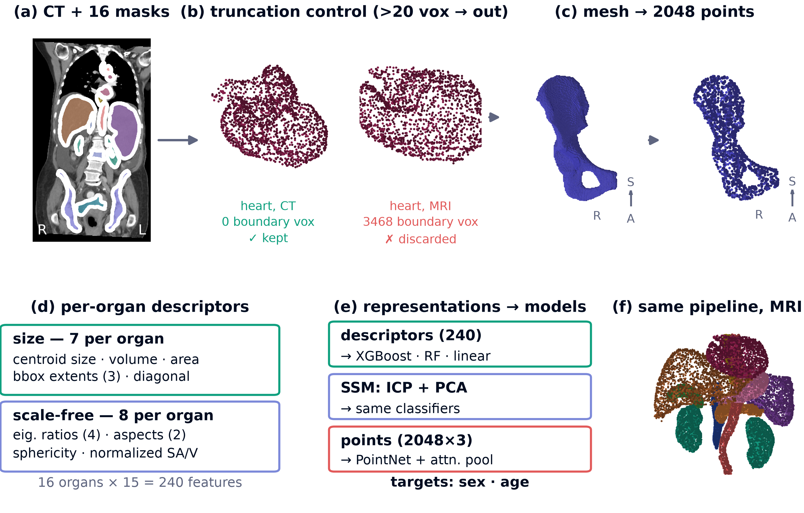
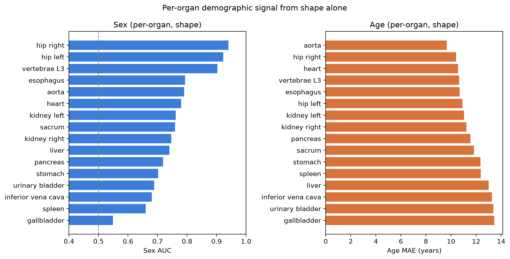
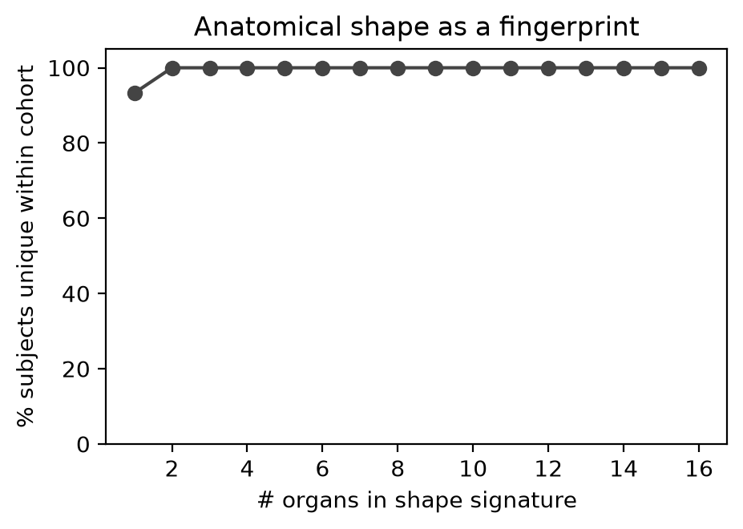

# shape-demographics

**What does anatomical *shape* know about you?**
Predicting demographic attributes from the 3D **shape** of anatomical structures alone (segmentations -> surface point clouds -> descriptors), with image intensity removed. This repository accompanies the ShapeMI @ MICCAI 2026 workshop paper and contains the full, reproducible pipeline.



*From a CT volume and its organ segmentations to point clouds, descriptors, and models. Organs clipped by the field of view are detected and discarded; the same pipeline runs unchanged on MRI. Generated by `scripts/make_pipeline_figure.py`.*

> **Reproducibility contract.** No number in the paper is hand-typed. Every
> figure, table, and statistic is generated from files in `experiments/` by the
> pipeline. Re-run a stage, and the results regenerate.

**If you find this work useful, please cite:**

> G. Luijten, B. Hinrichs-Puladi, M. Engelke, C. Wachinger, and J. Egger,
> "What Does Anatomical Shape Know About You? A Multi-Organ, Shape-Only Study
> of Demographic Prediction, Attribution, and Privacy,"
> ShapeMI workshop, MICCAI 2026 (proceedings to appear).

A BibTeX/CFF record is in [`CITATION.cff`](CITATION.cff). The paper PDF is not hosted here yet: publication is governed by a Springer Nature licence to publish, which sets when each version may be made public. See [`paper/`](paper/) for details, and write to the corresponding author if you need a copy in the meantime.

---

## Key Findings

- Sex from shape alone: **AUC 0.87** (95% CI 0.85–0.89); age: **MAE 9.3 yr** (R² 0.34)
- **Shape > intensity** for sex (0.87 vs 0.73) — against that baseline the sex signal is *geometric*
- Most of the sex signal is **organ size**; scale-free shape alone still gives AUC 0.79
- Strongest sex cue: **hip bones (AUC 0.94)** — recovers forensic pelvic dimorphism with no anatomical priors
- Generalises under **leave-one-institution-out** (sex AUC 0.83 on the large held-out site)
  and **across modality** — sex replicates on MRI (AUC 0.76), and a CT-trained model transfers to MRI (0.71)
- **Auto-labeling:** calibrated (ECE 0.04); labelling the most confident 50% gives 93.5% accuracy
- **Privacy:** quantized scale-free shape makes a single organ near-unique within the cohort

Every one of these numbers is read from a file in `experiments/` — see
`headline_stats.json`, `modality_comparison.csv`, `size_vs_shape.csv`,
`attribution.csv`, `loio.csv`, `crossmodal_results.json`, `labeling_results.json`,
`uniqueness_curve.csv`.

| Per-organ attribution | Within-cohort uniqueness |
|---|---|
|  |  |

---

## Quick Start (no data download, ~2 minutes)

```bash
bash setup.sh                      # creates ./.venv and installs the package (pip)
source .venv/bin/activate
python example/run_example.py      # offline synthetic demo
```

The example synthesises organ masks with sex/age-dependent shape and runs the pipeline end-to-end (see `example/README.md`).

### Alternative: conda

```bash
conda env create -f environment.yml && conda activate shapedem && pip install -e .
```

Both `setup.sh` (venv) and `conda env create` have been tested on **macOS (Apple Silicon)** and **Linux (NVIDIA GPU cluster)**. `setup.sh` auto-detects a working Python version (3.10–3.13); override with `PYTHON=python3.x bash setup.sh` if needed.

### Pinned environment

```bash
pip install -r requirements.lock.txt && pip install -e . --no-deps
```

`requirements.lock.txt` pins the classical pipeline to the exact versions used on
the compute cluster (Linux x86_64, Python 3.11). **PyTorch is not in the lock
file** — it is an optional dependency, so install it separately for the deep
stages:

```bash
pip install -e ".[deep]"        # or: pip install torch
```

Classical results (`analyze`, `stats`, `modality`, `labeling`, `compare`)
reproduce exactly across platforms. Deep-model metrics (PointNet) may shift
slightly between CPU and GPU due to floating-point differences in PyTorch, and
point-cloud resampling at load time is intentionally unseeded (it acts as
augmentation); results are averaged over 3 seeds so run-to-run variance is small.

---

## Data

| Dataset | Subjects | Used here | License | Source |
|---|---|---|---|---|
| TotalSegmentator v2 (CT) | 1,228 | 1,174 after exclusions | CC BY 4.0 | [Zenodo 8367088](https://doi.org/10.5281/zenodo.8367088) |
| TotalSegmentator-MRI | 298 | 240 with usable shapes, 196 with sex/age labels | CC BY-NC-SA 2.0 | [Zenodo 11367005](https://doi.org/10.5281/zenodo.11367005) |

The CT dataset drives all main analyses. The MRI dataset is used only for the
cross-modality experiment (step 4) and is downloaded automatically by
`python -m shapedem.cli crossmodal`.

Both datasets are attribution-licensed. If you use this pipeline, cite the
dataset papers and the dataset records alongside our paper:

- **CT:** Wasserthal J, et al. TotalSegmentator: Robust segmentation of 104
  anatomic structures in CT images. *Radiology: Artificial Intelligence*
  2023;5(5):e230024. [doi:10.1148/ryai.230024](https://doi.org/10.1148/ryai.230024).
  Dataset v2.0.0 (1,228 CT, 117 structures):
  [doi:10.5281/zenodo.8367088](https://doi.org/10.5281/zenodo.8367088), CC BY 4.0.
- **MRI:** Akinci D'Antonoli T, et al. TotalSegmentator MRI: Robust
  sequence-independent segmentation of multiple anatomic structures in MRI.
  *Radiology* 2025;314(2):e241613.
  [doi:10.1148/radiol.241613](https://doi.org/10.1148/radiol.241613).
  Dataset v1.0.0 (298 MRI, 56 structures):
  [doi:10.5281/zenodo.11367005](https://doi.org/10.5281/zenodo.11367005),
  CC BY-NC-SA 2.0 (non-commercial, share-alike).

BibTeX for all four is in [`CITATION.cff`](CITATION.cff) under `references`.

Download the CT data (scripted and resumable):

```bash
bash scripts/run_full_extract.sh   # download + extract all shapes (~23.6 GB download)
```

### Paths

No paths are hard-coded. Large artifacts go under `$SHAPEDEM_ROOT`
(default `./_workspace`). The repo ships with the directory structure
pre-created and one sample subject per dataset:

```
_workspace/
  data/                 # downloaded zips (run_full_extract.sh populates this)
  features/             # extracted point-cloud npz files (one dir per subject)
    totalseg/s0004/     # sample CT subject (20 organs)
    totalseg_mr/s0001/  # sample MRI subject (13 organs)
  cache/                # runtime cache
  example_output/       # output from run_example.py
```

To use a larger disk:

```bash
export SHAPEDEM_ROOT=/path/to/large/disk    # <-- SET THIS to a disk with ~50 GB free
```

---

## Reproducing All Results

```bash
# 0. Sanity gate (no full download; pulls a few subjects via HTTP range requests)
python -m shapedem.cli smoke

# 1. Full extraction (requires the TotalSegmentator download above)
bash scripts/run_full_extract.sh

# 2. Analysis stages (run in order)
python -m shapedem.cli meta          # cache labels
python -m shapedem.cli analyze       # attribution, size-vs-shape, uniqueness, fusion
python -m shapedem.cli intensity     # per-organ HU features from raw CT
python -m shapedem.cli modality      # shape vs intensity vs both
python -m shapedem.cli stats         # bootstrap CIs, leave-one-institution-out
python -m shapedem.cli labeling      # selective prediction, calibration, learning curves

# 3. Deep models (requires: pip install -e ".[deep]")
#    GPU recommended; runs on CPU but much slower
python -m shapedem.cli deep                    # PointNet
python -m shapedem.cli deep --encoder dgcnn    # DGCNN (static-graph variant, not reported)

# 4. Cross-modality (downloads TotalSegmentator-MRI, ~2 GB)
python -m shapedem.cli crossmodal

# 5. Comparison table + figures + result macros
python -m shapedem.cli compare
python -m shapedem.cli figures       # -> experiments/figures/
python -m shapedem.cli tables        # -> experiments/tables/ + experiments/results_macros.tex

# 6. Methods overview figure (fetches one CT subject over HTTP if absent)
python scripts/make_pipeline_figure.py    # -> experiments/figures/pipeline.{pdf,png}
```

Two further subcommands exist for partial runs: `extract` (the extraction step
that `run_full_extract.sh` wraps) and `baseline` (a single feature-regime
cross-validation, useful for quick checks).

<details>
<summary><b>Stage details (click to expand)</b></summary>

### Why this order?

Steps 2, 3, and 4 are independent of each other — they all read from the
extracted features and write separate result files. Step 5 (`compare`,
`figures`, `tables`) needs all prior stages to have run because it reads
their outputs to build summary tables and plots.

### Per-stage breakdown

| Stage | What it does | Output | Time |
|---|---|---|---|
| `smoke` | Quick sanity check — downloads a few subjects via HTTP range requests, extracts shapes, runs a tiny CV. No full download needed. | `experiments/smoke_results.json` (generated on run; not shipped) | ~2 min |
| `meta` | Parses the TotalSegmentator metadata CSV (age, sex, pathology, institute) and caches it as a label table. | `experiments/totalseg_labels.csv` | seconds |
| `extract` | Mask -> marching cubes (RAS mm) -> 2,048 surface points per organ, with field-of-view truncation control. Parallel and resumable. | `_workspace/features/<dataset>/<subject>/*.npz` | hours (full cohort) |
| `analyze` | Trains and evaluates **classical models** (XGBoost, 5-fold stratified CV) for sex classification and age regression. Runs per-organ attribution, size-vs-shape decomposition, cross-domain transfer, uniqueness analysis, and multi-organ fusion. | `attribution.csv`, `size_vs_shape.csv`, `cross_domain.csv`, `uniqueness_curve.csv`, `fusion.json`, `organ_presence.csv` | ~5 min |
| `intensity` | Extracts Hounsfield-unit statistics (mean, std, percentiles) from the raw CT volumes for each organ, using parallel workers. | `experiments/intensity_features.csv` | ~10 min |
| `modality` | Compares shape-only vs intensity-only vs combined features for sex and age prediction. | `experiments/modality_comparison.csv` | ~1 min |
| `stats` | Computes bootstrap 95% CIs on headline metrics (out-of-fold predictions), leave-one-institution-out generalization, institute demographics, uniqueness sensitivity to quantization, and truncation bias. | `headline_stats.json`, `loio.csv`, `institute_demographics.csv`, `uniqueness_sensitivity.csv`, `truncation_bias.csv` | ~5 min |
| `labeling` | Auto-labeling viability: selective prediction (accuracy vs coverage trade-off), calibration (ECE), and data-efficiency learning curves. | `selective_sex.csv`, `calibration_sex.csv`, `learning_curve_sex.csv`, `learning_curve_age.csv`, `labeling_results.json` | ~3 min |
| `deep` | Trains a multi-organ multi-task **PointNet** (or DGCNN with `--encoder dgcnn`) using the dataset's official train/val/test split. Validation-based early stopping, averaged over 3 seeds. Requires torch. Note: the DGCNN encoder here uses a **static** k-NN graph, a simplification of the original dynamic-graph method, and was therefore not evaluated for the paper. | `deep_results.json` (shipped) or `deep_dgcnn_results.json` (not shipped) | ~30 min (GPU) |
| `crossmodal` | Downloads TotalSegmentator-MRI (~2 GB), extracts MRI shapes, runs within-MRI CV and CT<->MRI transfer. | `crossmodal_results.json`, `totalseg_mr_labels.csv` | ~15 min |
| `compare` | Reads results from all prior stages and assembles a single comparison table (classical vs deep vs SSM vs volume-only baselines). | `experiments/comparison.csv` | ~5 min |
| `figures` | Generates the result plots (attribution, size-vs-shape, uniqueness, labeling, SSM modes) from the experiment CSVs. | `experiments/figures/*.png` and `.pdf` | seconds |
| `tables` | Generates LaTeX tables and `\newcommand` macros from experiment files, for use in the manuscript. | `experiments/tables/*.tex`, `experiments/results_macros.tex` | seconds |

</details>

### The methods overview figure

`scripts/make_pipeline_figure.py` renders the pipeline figure from real data:
one TotalSegmentator CT subject (fetched over ranged HTTP if not cached), the
cached point clouds, and the organ list read from `experiments/attribution.csv`.
It writes the composed figure plus every panel separately to
`experiments/figures/pipeline_panels/`.

The figure printed as Fig. 1 of the paper was assembled by hand from those
generated panels, so the paper version and `experiments/figures/pipeline.png`
differ in layout. Every panel in both is produced by this script; no panel is
drawn by hand.

---

## Repository Layout

```
shapedem/                  Python package
  cli.py                   command-line entry point (14 subcommands)
  config.py                YAML config loader (portable ${REPO}/${ROOT} tokens)
  data/totalseg.py         dataset access (HTTP range-requests + local zip)
  shapes/extract.py        mask -> marching cubes (RAS mm) -> point cloud + FOV-truncation QC
  shapes/descriptors.py    correspondence-free descriptors (size vs scale-free shape)
  shapes/ssm.py            ICP-correspondence SSM (PCA modes)
  intensity.py             per-organ Hounsfield-unit features
  pipeline.py              streaming, resumable extraction driver
  features.py              per-subject descriptor matrix (truncation-aware)
  models/multitask.py      multi-organ multi-task PointNet / DGCNN encoders
  train/baselines.py       GBM / RF / linear CV, bootstrap CIs, cross-domain transfer
  train/train_deep.py      deep training (early stopping, multi-seed)
  analysis/core.py         attribution, size-vs-shape, LOIO, uniqueness, model comparison
  analysis/figures.py      result figures
  analysis/tables.py       LaTeX tables + \newcommand macros from result files
  analysis/labeling.py     selective prediction, calibration, learning curves
  crossmodal.py            TotalSegmentator-MRI download + CT<->MRI transfer
configs/default.yaml       organs, paths, label definitions, thresholds
scripts/                   run_full_extract.sh, make_pipeline_figure.py
experiments/               result CSVs/JSONs, figures, tables — git-tracked
tests/                     unit tests (pytest)
example/                   offline synthetic demo
paper/                     note on paper availability (PDF follows publication)
CITATION.cff               citation metadata
DISCLAIMER.md              disclosure on the use of large language models
LICENSE                    MIT (code); datasets keep their own licences
```

---

## Tests

```bash
pip install -e ".[dev]" && pytest -q
```

15 test functions (16 cases; one deep-model test is parametrised over both
encoders) covering shape extraction, truncation detection, sphere descriptors,
Umeyama alignment, cross-validation, config loading, deep-model forward passes,
and intensity features. All use synthetic data — no downloads.

Without PyTorch installed, the deep-model module is skipped and the suite
reports `11 passed, 1 skipped`.

---

## Ethics & Responsible Use

We predict **sex and age only**. We deliberately do **not** predict race or
ethnicity. The privacy results are an **upper bound on linkability** within one
cohort, not a demonstrated re-identification rate, and are intended as a caution
about sharing "de-identified" segmentations — not as a tool for identifying
anyone.

## Use of Large Language Models

Large language models assisted with literature search, code scaffolding, and
drafting. Study design, code, experiments, results, and the final text were
reviewed and approved by the first author. See [`DISCLAIMER.md`](DISCLAIMER.md).

## License

Code: MIT (see [`LICENSE`](LICENSE)). The TotalSegmentator datasets retain their
own licences (CT: CC BY 4.0; MRI: CC BY-NC-SA 2.0, non-commercial and
share-alike); derived shapes are redistributed only where those licences permit.
